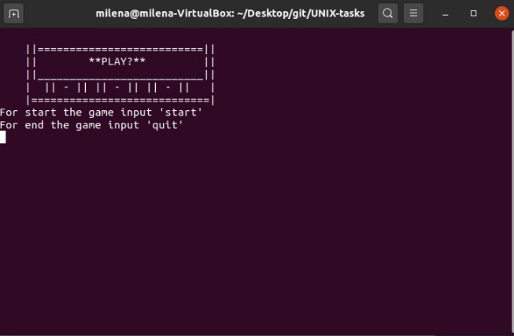

# UNIX-tasks
### Задание   
Напишите скрипт-игровой автомат. Скрипт должен быть интерактивным, цикличным, юзер запускает скрипт, скрипт начинает игру.  
Скрипт должен рандомно сгенерить три цифры(0-9). Юзер может победить если ему выпадут три одинаковых цифры.  
Цифры показывайте с интервалом в секунду(можно в разных строках). Сделайте вероятность выигрыша равной 20%(любым способом на ваш выбор).  
Не позволяйте юзеру совершать серии побед более 3 подряд.  
При победе скачивайте из сети веселую картинку и запускайте ее линуксовым просмотрщиком картинок.  
При проигрыше - то же самое, но с грустной картинкой. Линки на картинки хардкодьте.  

### Запуск
`bash slot.sh`  

### Внешний вид  
  